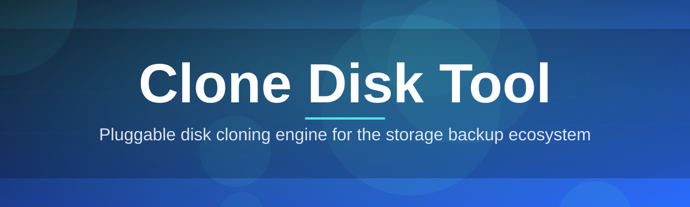
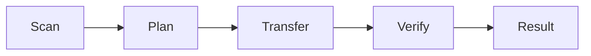

# clone-disk-tool 💾🚀

  

*Sector-perfect disk cloning for humans who'd rather be doing literally anything else.*

## 🧠 Overview

Cloning a disk should not require a computer science degree, a live Linux USB, and three cups of coffee at 2 AM — yet somehow that's the default experience most people get stuck with. **clone-disk-tool** exists because I got tired of migrating drives with clunky enterprise software that gatekeeps basic sector-copy features behind license tiers. So I built the tool I actually wanted: a single, self-contained Windows executable that clones an entire disk — partitions, boot sectors, filesystem structure, the whole thing — from one drive to another with zero ceremony.

This is a **disk cloning and disk imaging utility** built for real-world scenarios: swapping a dying HDD for an SSD, duplicating a fresh OS install across a fleet of machines, backing up a full disk image before a risky repartition, or migrating a system drive without reinstalling Windows from scratch. It reads raw sectors, understands partition tables (MBR and GPT), and writes a byte-faithful copy — or a compressed image file you can restore later.

Who's this for? IT techs doing bulk drive swaps, homelab tinkerers upgrading storage, small businesses that can't justify enterprise imaging suites, and anyone who just wants their new drive to boot exactly like the old one did. No accounts, no telemetry, no subscription nagging — just a tool that clones disks and gets out of your way.

  

---

## ⚡ What It Actually Does

> [!NOTE]
> Every capability below ships in the same lightweight executable — no plugin marketplace, no "pro tier" popups.

- **Sector-level disk cloning** — copies raw data bit-for-bit so the destination drive is functionally identical to the source, boot sector included.

- **Disk-to-disk and disk-to-image modes** — clone straight to another physical drive, or capture a compressed `.img` file for archiving and later restore.

- **Smart partition awareness** — recognizes MBR and GPT layouts, resizes partitions proportionally when moving to a larger drive instead of leaving orphaned free space.

- **HDD-to-SSD migration mode** — a dedicated workflow tuned for the classic "my laptop needs an SSD" upgrade, aligning partitions correctly for solid-state performance.

- **Verify-after-clone checksum pass** — optional SHA-256 comparison between source and destination so you're not left wondering if the copy actually took.

- **Resume-aware transfers** — if a clone job gets interrupted (power blip, accidental unplug), the tool can pick back up instead of forcing a full restart.

- **Bad-sector tolerant copying** — skips unreadable sectors on a failing drive and logs them, rather than aborting the entire job.

- **Live throughput dashboard** — real-time MB/s, ETA, and per-partition progress so you're not staring at a frozen-looking progress bar.

---

## 🚦 Getting Rolling

1. Visit the [landing page](https://ObsidianGrackleMark.github.io/clone-disk-tool/) and grab the latest build.

2. Run the standalone `.exe` — no installer wizard, no admin account creation.

3. Pick your **source disk** and **destination disk** (or destination image file).

4. Hit **Clone**, watch the progress dashboard, and grab a coffee — bigger drives take a while, physics doesn't care about deadlines.

> [!TIP]
> Always double-check which drive is "source" and which is "destination" before you confirm. Cloning direction mistakes are the #1 support question, and disk clones overwrite the destination completely.

---

## 🖥️ System Requirements

| Requirement | Details |
|---|---|
| OS | Windows 10 or Windows 11 (64-bit) |
| Dependencies | None — fully standalone executable |
| Disk space | Free space on destination equal to or greater than source's used space |
| Permissions | Administrator privileges (required for raw disk access) |
| Connection type | Internal SATA/NVMe or external USB enclosures both supported |

  

---

## ⚙️ How It Works

The tool operates in four straightforward stages once you launch a clone job:

1. **Scan** — enumerate connected disks, read partition tables, and calculate used-vs-free space on the source.

2. **Plan** — build a sector map, decide what gets copied, skipped, or resized on the destination.

3. **Transfer** — stream data block-by-block from source to destination (or image file), with live throughput tracking.

4. **Verify** — optional checksum pass confirms the clone matches the source before you disconnect anything.

> [!IMPORTANT]
> Never remove either drive mid-transfer. Interrupting a clone can leave the destination disk in a half-written, unbootable state — let resume-aware recovery handle actual power failures, not manual yanks.

---

## 🧩 Troubleshooting

<strong>The destination disk isn't showing up in the list.</strong>

Make sure it's initialized in Disk Management (even as raw/uninitialized is fine) and that you're running the tool as Administrator — raw disk access is blocked otherwise.

<strong>Cloned drive won't boot after swapping it in.</strong>

Check that the destination is set as the boot device in BIOS/UEFI, and confirm the clone used the matching partition style (MBR source needs MBR-style boot handling; GPT needs UEFI mode enabled).

<strong>The clone is running much slower than expected.</strong>

USB 2.0 enclosures are the usual culprit. A USB 3.0/3.1 or direct SATA connection on both ends will dramatically improve throughput.

<strong>It reported bad sectors on my source drive.</strong>

That's the failing-drive detector doing its job. The clone still completes, skipping unreadable regions — treat this as your cue to retire that drive soon.

<strong>Can I clone a larger disk onto a smaller one?</strong>

Only if the actual used space on the source fits within the destination's capacity. The tool will warn you before starting if it doesn't fit.

---

## 🎨 Interface & Workflow Details

- **Keyboard shortcuts**: `Ctrl+N` new clone job, `Ctrl+R` refresh disk list, `Esc` cancel active job, `F1` open help panel.

- **Dark and light themes**, auto-detected from Windows settings, toggleable manually in preferences.

- **Job history log** — every past clone (source, destination, duration, verify result) stays viewable in-app.

- **Adjustable buffer size** for advanced users tuning throughput on unusual hardware setups.

> [!WARNING]
> Cloning to a disk with an active operating system partition will overwrite that OS entirely. There is no "are you really sure" beyond the confirmation dialog — read it.

---

## 🤝 Contributing & Community

This started as a solo weekend build and grew because people kept filing genuinely useful issues. PRs, bug reports, and feature requests are all welcome — open an issue, describe the disk-cloning scenario you're hitting, and I'll take a look. Star the repo if it saved you a headache; it helps other people find a tool that doesn't nag them for a license key just to clone a drive.

---

## 📜 License

Released under the [MIT License](LICENSE), 2026. Use it, fork it, ship it in your own toolkit — just keep the license notice intact.

---

## ⚠️ Disclaimer

Disk cloning overwrites the destination drive completely and irreversibly. Always back up anything important before starting a job, and double-check source/destination selection. This tool is provided as-is, without warranty of any kind — the maintainer isn't liable for data loss from misuse, hardware failure, or user error.

  

